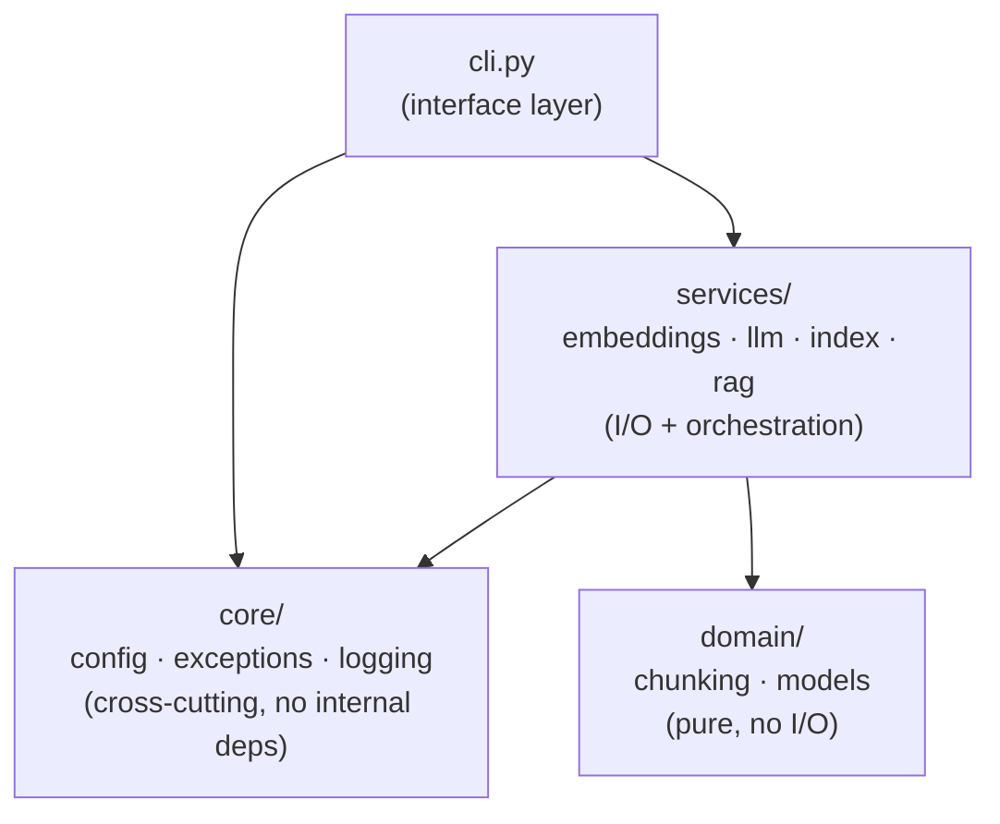
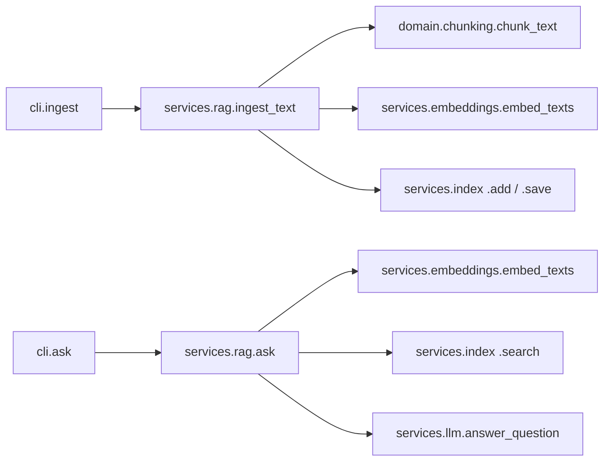

# RAG From Scratch

The first project in RAGLab, and the simplest one: retrieval-augmented
generation with no RAG framework and no vector-database service. Just the
actual mechanics — chunking, embeddings, cosine similarity, and prompt
assembly — written out plainly so there's nothing hidden behind an
abstraction.

It's fully standalone: no dependency on anything else in this repo.

## What it does

1. **`ingest`** — read a text file, split it into overlapping word-window
   chunks (`src/plainrag/domain/chunking.py`), embed each chunk
   (`src/plainrag/services/embeddings.py`, via `litellm` — any embedding
   provider it supports works), and save the result to a small on-disk
   index (`src/plainrag/services/index.py`: a NumPy array of vectors plus
   their source text, no vector-database server involved).
2. **`ask`** — embed the question the same way, retrieve the top-k most
   similar chunks by cosine similarity, assemble them into a prompt with
   citations, and ask an LLM (`src/plainrag/services/llm.py`, also via
   `litellm`) to answer strictly from that context.

## Architecture

Three layers, each with one job, dependencies pointing one direction only:



- **`domain/`** — pure logic and shared types, no I/O: `chunking.py`
  (the word-window splitter) and `models.py` (`DocumentChunk`,
  `ScoredChunk`, `AnswerResult`).
- **`services/`** — anything touching the network or disk, plus the
  orchestration that ties it together: `embeddings.py` and `llm.py`
  (direct `litellm` calls), `index.py` (the on-disk cosine-similarity
  index), and `rag.py` (`ingest_text()` / `ask()`).
- **`core/`** — cross-cutting concerns with no dependencies on the rest
  of the package: `config.py` (settings), `exceptions.py` (the error
  hierarchy), `logging.py` (console/file logging plus the startup
  banner).
- **`cli.py`** — the only loose module, and the only place that reads
  configuration. It resolves settings once, passes plain values into
  `services.rag`, and is the only place that catches `PlainRAGError`
  and turns it into a clean exit code instead of a traceback.

Call graph for both commands:



This is a hardening pass, not a rewrite: the chunking algorithm,
cosine-similarity math, prompt assembly, and every `litellm` call are
exactly what they were before. Nothing here hides the mechanics behind
a framework — it's still directly readable top to bottom, just
organized so config, errors, and layers don't leak into each other.

## Run it

```bash
uv sync
cp .env.example .env   # fill in OPENAI_API_KEY, or point at any litellm-supported provider

uv run plainrag ingest path/to/some.txt
uv run plainrag ask "What does the document say about X?"
```

Or with `make` (see `make help` for the full list):

```bash
make install
make ingest FILE=path/to/some.txt
make ask QUESTION="What does the document say about X?"
```

No separate service — the index is just a file on disk
(`.plainrag_index.json` by default). A `Dockerfile`/`docker-compose.yml`
are included for convenience, not because anything here needs them —
`data/` on the host is mounted into the container so ingested files and
the index persist across runs:

```bash
make docker-build
make docker-run ARGS="ingest some.txt"       # reads/writes under ./data
make docker-run ARGS='ask "What does X say?"'
```

## Why build this "the hard way"

Every other project in RAGLab uses a framework or a real vector database
for good reasons (they handle edge cases this doesn't). This one exists to
make those mechanics legible before hiding them: what a chunk actually is,
what an embedding actually looks like, and what "retrieval" actually
computes, with nothing abstracted away.

## Design notes / tradeoffs

- **Chunking is word-count-based**, not semantic — simple to reason about
  and test, but it can split a sentence in half. A production chunker
  would respect sentence/paragraph boundaries.
- **The index is a flat NumPy array with brute-force cosine similarity** —
  O(n) per query. Fine for a few thousand chunks; a real vector database
  (see `02-document-qa-foundation` and later projects) uses an ANN index
  instead, which is exactly the tradeoff that makes it a separate concern.
- **No shared package.** This project doesn't depend on anything else in
  the repo — a deliberate choice so it stays trivially runnable and so
  later projects don't inherit assumptions from this one before they've
  earned a shared abstraction.
