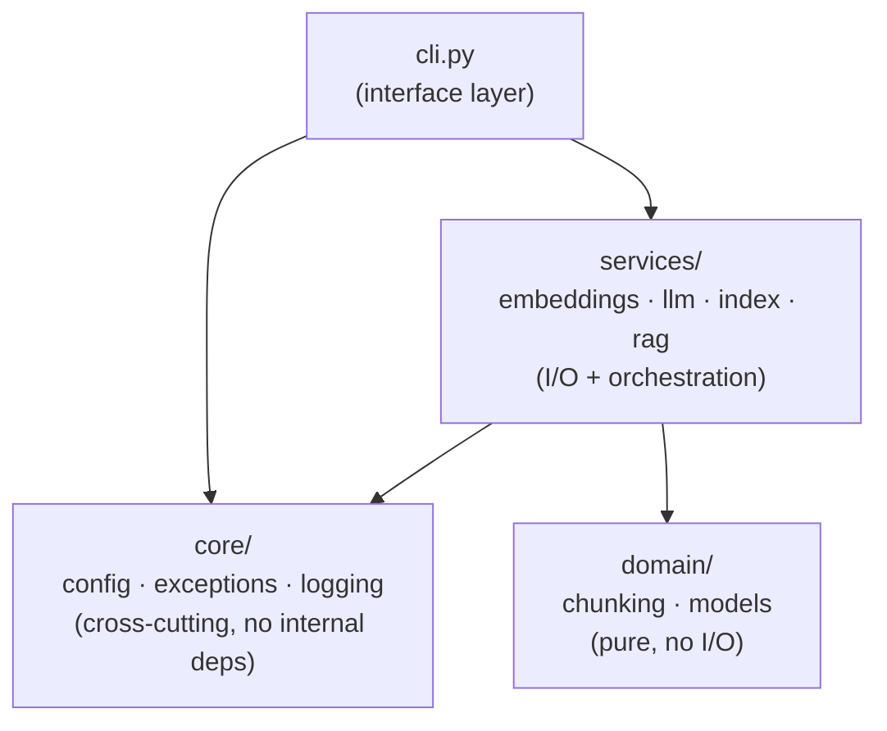
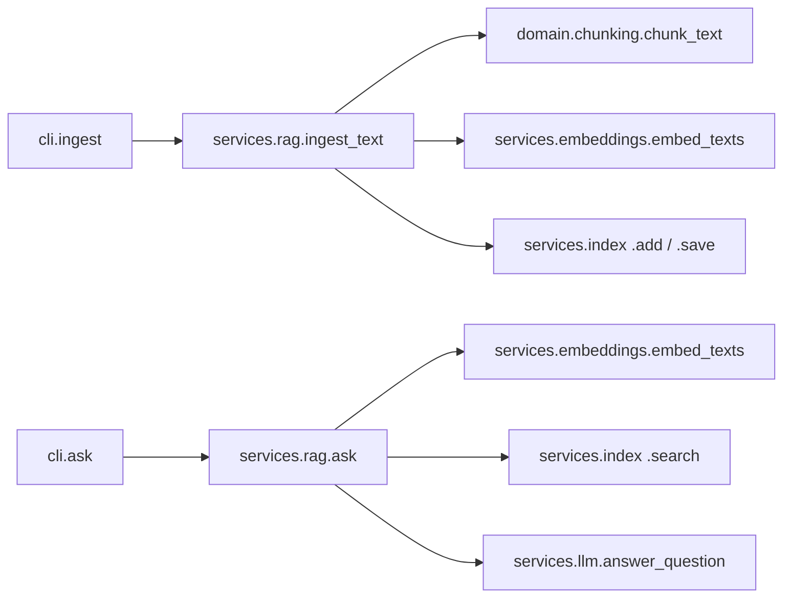

# plainrag Production-Grade Restructure Implementation Plan

> **For agentic workers:** REQUIRED SUB-SKILL: Use superpowers:subagent-driven-development (recommended) or superpowers:executing-plans to implement this plan task-by-task. Steps use checkbox (`- [ ]`) syntax for tracking.

**Goal:** Restructure `plainrag` from eight flat modules into a layered package (`core/`, `domain/`, `services/`, plus top-level `cli.py`) with centralized settings, a custom exception hierarchy, CLI-level error handling, and an enhanced logger (console/file formatters + startup banner) — without changing any RAG mechanics.

**Architecture:** Three layers with dependencies pointing one direction only: `domain/` (pure, no I/O) ← `services/` (I/O + orchestration, depends on `domain/` and `core/`) ← `cli.py` (the only module that reads config and catches errors). `core/` (config, exceptions, logging) is a leaf with no internal dependencies.

**Tech Stack:** Python 3.14, `pydantic-settings` (new direct dep), `rich` (new direct dep, already transitive via `typer`), `loguru`, `typer`, `litellm`, `pytest` + `pytest-asyncio`.

**Spec:** `docs/superpowers/specs/2026-09-13-production-architecture-design.md`

## Global Constraints

- Python `>=3.14`, `mypy --strict`, ruff `select = ["E","F","I","UP","B","SIM"]`, `ignore = ["E501"]`, line-length 100.
- No provider abstraction / DI / plugin architecture — services call `litellm` directly (spec's "layered, but still direct" scope decision).
- `chunk_text()`'s argument-validation errors stay plain `ValueError`, never wrapped in the new exception hierarchy.
- Only `cli.py` calls `get_settings()`; `domain/` and `services/` receive plain arguments, never read global settings themselves.
- `log_file` defaults to `None` (console-only) — the project must not start writing files unless a user opts in via `PLAINRAG_LOG_FILE` / `.env`.
- Every new/moved module keeps `from __future__ import annotations` and Google-style docstrings (Args/Returns/Raises), matching the existing codebase's convention.
- Test tree mirrors the source tree (`tests/core/`, `tests/domain/`, `tests/services/`), each with an `__init__.py`, matching the existing `tests/__init__.py` convention.
- Use `git mv` for pure relocations so history is preserved (the codebase already does this — see commit `723f195`).
- Run `uv run pytest tests/<path> -v` (not the whole suite) after each task's own changes, and the full suite (`make test` / `make check`) at the end of the plan.

---

## File Structure

```text
src/plainrag/
  __init__.py              # MODIFY: add __version__
  cli.py                   # MODIFY: settings, banner, exception handling
  core/
    __init__.py             # NEW: empty
    config.py                # NEW: Settings, get_settings()
    exceptions.py             # NEW: PlainRAGError hierarchy
    logging.py                 # NEW (git mv from logging_setup.py): formatters + banner
  domain/
    __init__.py               # NEW: empty
    models.py                  # NEW: DocumentChunk, ScoredChunk, AnswerResult
    chunking.py                 # NEW (git mv from chunking.py): unchanged content
  services/
    __init__.py                 # NEW: empty
    embeddings.py                # NEW (git mv from embeddings.py): + EmbeddingError
    llm.py                        # NEW (git mv from llm.py): + GenerationError
    index.py                       # NEW (git mv from index.py): + IndexPersistenceError
    rag.py                          # NEW (git mv from rag.py): + EmptyIndexError

tests/
  test_cli.py               # MODIFY: import paths, banner tests
  core/
    __init__.py               # NEW
    test_config.py             # NEW
    test_exceptions.py          # NEW
    test_logging.py              # NEW
  domain/
    __init__.py                 # NEW
    test_chunking.py             # NEW (git mv from tests/test_chunking.py)
  services/
    __init__.py                   # NEW
    test_embeddings.py             # NEW (git mv): + failure-path test
    test_llm.py                     # NEW (git mv): + failure-path test
    test_index.py                    # NEW (git mv): + failure-path tests
    test_rag.py                       # NEW (git mv): + EmptyIndexError test, replacing old empty-index test

pyproject.toml               # MODIFY: add pydantic-settings, rich as direct deps
README.md                    # MODIFY: Architecture section with 2 Mermaid diagrams, path updates
```

Note: the approved spec's testing tree listed `test_config.py` at the top of `tests/`; this plan places it under `tests/core/` alongside `test_logging.py` and the new `test_exceptions.py` for consistency with the `src/plainrag/core/` package it tests. This is a minor, mechanical correction, not a scope change.

---

### Task 1: Add `pydantic-settings` and `rich` as direct dependencies

**Files:**
- Modify: `pyproject.toml`

**Interfaces:**
- Produces: `pydantic_settings` and `rich` importable from the project's venv (both are already installed transitively today via `litellm`/`typer`, so `uv sync` only changes the lockfile's direct-dependency bookkeeping, not what's installed).

- [ ] **Step 1: Add the two dependencies**

In `pyproject.toml`, change:

```toml
dependencies = [
    "litellm>=1.52",
    "pydantic>=2.9",
    "loguru>=0.7.2",
    "typer>=0.15",
    "numpy>=2.1",
]
```

to:

```toml
dependencies = [
    "litellm>=1.52",
    "pydantic>=2.9",
    "pydantic-settings>=2.15",
    "rich>=13.9",
    "loguru>=0.7.2",
    "typer>=0.15",
    "numpy>=2.1",
]
```

- [ ] **Step 2: Sync and verify both import cleanly**

Run: `uv sync`
Run: `uv run python -c "import pydantic_settings, rich; print('ok')"`
Expected: `ok`, and `uv sync` reports no new installs (both were already present transitively).

- [ ] **Step 3: Commit**

```bash
git add pyproject.toml uv.lock
git commit -m "Add pydantic-settings and rich as direct dependencies"
```

---

### Task 2: `core/config.py` — Settings and `get_settings()`

**Files:**
- Create: `src/plainrag/core/__init__.py`
- Create: `src/plainrag/core/config.py`
- Create: `tests/core/__init__.py`
- Create: `tests/core/test_config.py`

**Interfaces:**
- Produces: `plainrag.core.config.Settings` (a `pydantic_settings.BaseSettings` with fields `embedding_model: str`, `chat_model: str`, `chunk_size: int`, `chunk_overlap: int`, `retrieval_k: int`, `index_path: Path`, `log_level: str`, `log_file: Path | None`) and `plainrag.core.config.get_settings() -> Settings` (an `lru_cache`d factory). Consumed by Task 11 (`cli.py`).

- [ ] **Step 1: Create the empty `core` package marker**

Create `src/plainrag/core/__init__.py` with empty content (0 bytes).

- [ ] **Step 2: Create `tests/core/__init__.py`**

Empty content (0 bytes), matching the existing `tests/__init__.py` package-style test tree.

- [ ] **Step 3: Write the failing tests**

Create `tests/core/test_config.py`:

```python
"""Tests for plainrag.core.config."""

from __future__ import annotations

from pathlib import Path

import pytest

from plainrag.core.config import Settings, get_settings


class TestSettings:
    def test_defaults(self) -> None:
        settings = Settings(_env_file=None)

        assert settings.embedding_model == "text-embedding-3-small"
        assert settings.chat_model == "gpt-4o-mini"
        assert settings.chunk_size == 200
        assert settings.chunk_overlap == 20
        assert settings.retrieval_k == 4
        assert settings.index_path == Path(".plainrag_index.json")
        assert settings.log_level == "INFO"
        assert settings.log_file is None

    def test_reads_overrides_from_prefixed_environment_variables(
        self, monkeypatch: pytest.MonkeyPatch
    ) -> None:
        monkeypatch.setenv("PLAINRAG_CHAT_MODEL", "gpt-4o")
        monkeypatch.setenv("PLAINRAG_CHUNK_SIZE", "500")

        settings = Settings(_env_file=None)

        assert settings.chat_model == "gpt-4o"
        assert settings.chunk_size == 500


class TestGetSettings:
    def test_returns_the_same_cached_instance_on_repeated_calls(self) -> None:
        get_settings.cache_clear()
        try:
            assert get_settings() is get_settings()
        finally:
            get_settings.cache_clear()
```

- [ ] **Step 4: Run to verify it fails**

Run: `uv run pytest tests/core/test_config.py -v`
Expected: FAIL with `ModuleNotFoundError: No module named 'plainrag.core'`

- [ ] **Step 5: Implement `core/config.py`**

```python
"""Centralized settings — the only place environment/config gets read
directly; everything else receives plain values as arguments.
"""

from __future__ import annotations

from functools import lru_cache
from pathlib import Path

from pydantic_settings import BaseSettings, SettingsConfigDict


class Settings(BaseSettings):
    """Runtime configuration, resolved from environment variables and .env.

    All fields can be overridden via a `PLAINRAG_<FIELD_NAME>` environment
    variable or a `.env` file in the working directory.
    """

    model_config = SettingsConfigDict(env_prefix="PLAINRAG_", env_file=".env", extra="ignore")

    embedding_model: str = "text-embedding-3-small"
    chat_model: str = "gpt-4o-mini"
    chunk_size: int = 200
    chunk_overlap: int = 20
    retrieval_k: int = 4
    index_path: Path = Path(".plainrag_index.json")
    log_level: str = "INFO"
    log_file: Path | None = None


@lru_cache
def get_settings() -> Settings:
    """Return the process-wide Settings instance, built once and cached."""
    return Settings()
```

- [ ] **Step 6: Run to verify it passes**

Run: `uv run pytest tests/core/test_config.py -v`
Expected: 3 passed

- [ ] **Step 7: Commit**

```bash
git add src/plainrag/core/__init__.py src/plainrag/core/config.py tests/core/__init__.py tests/core/test_config.py
git commit -m "Add core/config.py: centralized Settings"
```

---

### Task 3: `core/exceptions.py` — exception hierarchy

**Files:**
- Create: `src/plainrag/core/exceptions.py`
- Create: `tests/core/test_exceptions.py`

**Interfaces:**
- Produces: `plainrag.core.exceptions.{PlainRAGError, EmbeddingError, GenerationError, IndexPersistenceError, EmptyIndexError}`. Consumed by Tasks 7, 8, 9, 10, 11.

- [ ] **Step 1: Write the failing tests**

Create `tests/core/test_exceptions.py`:

```python
"""Tests for plainrag.core.exceptions."""

from __future__ import annotations

import pytest

from plainrag.core.exceptions import (
    EmbeddingError,
    EmptyIndexError,
    GenerationError,
    IndexPersistenceError,
    PlainRAGError,
)


@pytest.mark.parametrize(
    "exc_type", [EmbeddingError, GenerationError, IndexPersistenceError, EmptyIndexError]
)
class TestExceptionHierarchy:
    def test_is_a_plainrag_error(self, exc_type: type[PlainRAGError]) -> None:
        assert issubclass(exc_type, PlainRAGError)

    def test_carries_its_message(self, exc_type: type[PlainRAGError]) -> None:
        assert str(exc_type("something failed")) == "something failed"
```

- [ ] **Step 2: Run to verify it fails**

Run: `uv run pytest tests/core/test_exceptions.py -v`
Expected: FAIL with `ModuleNotFoundError: No module named 'plainrag.core.exceptions'`

- [ ] **Step 3: Implement `core/exceptions.py`**

```python
"""Exceptions for failures talking to the network or disk.

Argument-validation errors on pure functions (e.g. chunk_text's bad
chunk_size/overlap) stay plain ValueError — this hierarchy is
specifically for runtime/I/O failures at a service boundary.
"""

from __future__ import annotations


class PlainRAGError(Exception):
    """Base class for all plainrag errors."""


class EmbeddingError(PlainRAGError):
    """An embedding provider call failed."""


class GenerationError(PlainRAGError):
    """A chat completion call failed."""


class IndexPersistenceError(PlainRAGError):
    """The on-disk index could not be loaded or saved."""


class EmptyIndexError(PlainRAGError):
    """Asked a question against an index with nothing ingested."""
```

- [ ] **Step 4: Run to verify it passes**

Run: `uv run pytest tests/core/test_exceptions.py -v`
Expected: 8 passed

- [ ] **Step 5: Commit**

```bash
git add src/plainrag/core/exceptions.py tests/core/test_exceptions.py
git commit -m "Add core/exceptions.py: PlainRAGError hierarchy"
```

---

### Task 4: `core/logging.py` — rename + formatters + banner

**Files:**
- Modify (rename): `src/plainrag/logging_setup.py` → `src/plainrag/core/logging.py`
- Create: `tests/core/test_logging.py`

**Interfaces:**
- Consumes: nothing from this codebase (only `loguru`, `rich`, stdlib).
- Produces: `plainrag.core.logging.get_logger(*, level: str = "INFO", log_file: Path | None = None) -> Logger` and `plainrag.core.logging.print_banner(version: str) -> None`. Consumed by Task 11 (`cli.py`).

- [ ] **Step 1: Move the file**

```bash
git mv src/plainrag/logging_setup.py src/plainrag/core/logging.py
```

- [ ] **Step 2: Write the failing tests**

Create `tests/core/test_logging.py`:

```python
"""Tests for plainrag.core.logging."""

from __future__ import annotations

from pathlib import Path

import pytest
from loguru import logger as loguru_logger

from plainrag.core.logging import get_logger, print_banner


class TestGetLogger:
    def test_returns_the_loguru_logger(self) -> None:
        assert get_logger() is loguru_logger

    def test_writes_to_the_given_log_file_when_one_is_configured(self, tmp_path: Path) -> None:
        log_file = tmp_path / "plainrag.log"
        logger = get_logger(log_file=log_file)

        logger.info("hello")
        logger.remove()  # flush/close the file sink before reading it back

        assert "hello" in log_file.read_text()


class TestPrintBanner:
    def test_prints_the_app_name_and_version(self, capsys: pytest.CaptureFixture[str]) -> None:
        print_banner("0.1.0")

        captured = capsys.readouterr()
        assert "plainrag" in captured.out
        assert "0.1.0" in captured.out
```

- [ ] **Step 3: Run to verify it fails**

Run: `uv run pytest tests/core/test_logging.py -v`
Expected: FAIL — `print_banner` doesn't exist yet, and `get_logger`'s "configure once" guard means the file-sink test would silently do nothing even after the rename.

- [ ] **Step 4: Rewrite `core/logging.py`**

Replace the entire file content with:

```python
"""Console + optional file logging, and a one-time startup banner.

Deliberately not importing a shared `raglab_common`: this project doesn't
depend on anything else in the repo.
"""

from __future__ import annotations

import sys
from pathlib import Path
from typing import TYPE_CHECKING

from loguru import logger as _logger
from rich.console import Console
from rich.panel import Panel

if TYPE_CHECKING:
    from loguru import Logger

_CONSOLE_FORMAT = "<green>{time:HH:mm:ss}</green> | <level>{level: <8}</level> | {message}"
_FILE_FORMAT = "{time:YYYY-MM-DD HH:mm:ss} | {level: <8} | {name}:{function}:{line} | {message}"


def get_logger(*, level: str = "INFO", log_file: Path | None = None) -> Logger:
    """Configure console (and optional file) sinks and return the logger.

    Reconfigures on every call rather than guarding with a "first call
    wins" flag — cheap, and it keeps this testable without global state
    leaking between tests. Safe in practice since it's normally called
    once per process, at CLI startup.

    Args:
        level: Minimum level for both sinks.
        log_file: If given, also log to this file (rotated at 10 MB,
            kept for 7 days). If omitted, console-only.

    Returns:
        The process-wide loguru logger.
    """
    _logger.remove()
    _logger.add(sys.stderr, level=level, format=_CONSOLE_FORMAT)
    if log_file is not None:
        _logger.add(
            log_file, level=level, format=_FILE_FORMAT, rotation="10 MB", retention="7 days"
        )
    return _logger


def print_banner(version: str) -> None:
    """Print a one-time startup banner to the console (not logged).

    Args:
        version: The application version to display.
    """
    console = Console()
    console.print(
        Panel.fit(
            f"[bold cyan]plainrag[/] [dim]v{version}[/]\n"
            "[dim]RAG from scratch — no framework, no vector-DB service[/]",
            border_style="cyan",
        )
    )
```

- [ ] **Step 5: Run to verify it passes**

Run: `uv run pytest tests/core/test_logging.py -v`
Expected: 3 passed

- [ ] **Step 6: Commit**

```bash
git add src/plainrag/core/logging.py tests/core/test_logging.py
git commit -m "Rename logging_setup.py to core/logging.py; add formatters and startup banner"
```

---

### Task 5: `domain/models.py` — shared data types

**Files:**
- Create: `src/plainrag/domain/__init__.py`
- Create: `src/plainrag/domain/models.py`

**Interfaces:**
- Produces: `plainrag.domain.models.{DocumentChunk, ScoredChunk, AnswerResult}` (dataclasses, identical fields to today's `plainrag.index.DocumentChunk`/`ScoredChunk` and `plainrag.rag.AnswerResult`). Consumed by Tasks 8, 9, 10, and indirectly by CLI tests via `services.index`/`services.rag`.

This is a pure extraction with no new behavior — unlike other tasks, its own test coverage comes from Tasks 8-10's consumers, matching how the original codebase never unit-tested these dataclasses in isolation either. Verification here is an import + mypy check, not a new pytest file.

- [ ] **Step 1: Create the empty `domain` package marker**

Create `src/plainrag/domain/__init__.py` with empty content (0 bytes).

- [ ] **Step 2: Create `domain/models.py`**

```python
"""Shared data types used across the domain, services, and CLI layers."""

from __future__ import annotations

from dataclasses import dataclass


@dataclass
class DocumentChunk:
    """One chunk of source text, embedded and ready to be searched.

    Attributes:
        text: The chunk's raw text.
        source: Where it came from (e.g. a file path), surfaced as a
            citation when the chunk is retrieved.
        embedding: Its embedding vector.
    """

    text: str
    source: str
    embedding: list[float]


@dataclass
class ScoredChunk:
    """A retrieved chunk paired with its similarity to the query."""

    chunk: DocumentChunk
    score: float


@dataclass
class AnswerResult:
    """An answer paired with the chunks it was grounded in.

    Attributes:
        answer: The generated answer text.
        sources: The retrieved chunks used to ground it, most relevant
            first — empty if the index had nothing to retrieve.
    """

    answer: str
    sources: list[ScoredChunk]
```

- [ ] **Step 3: Verify it imports and type-checks**

Run: `uv run python -c "from plainrag.domain.models import AnswerResult, DocumentChunk, ScoredChunk; print('ok')"`
Expected: `ok`

Run: `uv run mypy src/plainrag/domain/models.py`
Expected: `Success: no issues found in 1 source file`

- [ ] **Step 4: Commit**

```bash
git add src/plainrag/domain/__init__.py src/plainrag/domain/models.py
git commit -m "Add domain/models.py: DocumentChunk, ScoredChunk, AnswerResult"
```

---

### Task 6: `domain/chunking.py` — move

**Files:**
- Modify (rename): `src/plainrag/chunking.py` → `src/plainrag/domain/chunking.py`
- Modify (rename): `tests/test_chunking.py` → `tests/domain/test_chunking.py`
- Create: `tests/domain/__init__.py`

**Interfaces:**
- Produces: `plainrag.domain.chunking.chunk_text(text, *, chunk_size=200, overlap=20) -> list[str]` (unchanged signature). Consumed by Task 10 (`services/rag.py`).

`chunking.py` has zero internal imports (only stdlib), so this is a pure move — no content changes.

- [ ] **Step 1: Move the source file**

```bash
git mv src/plainrag/chunking.py src/plainrag/domain/chunking.py
```

- [ ] **Step 2: Create the test package marker and move the test file**

```bash
mkdir -p tests/domain
git mv tests/test_chunking.py tests/domain/test_chunking.py
```

Create `tests/domain/__init__.py` with empty content (0 bytes).

- [ ] **Step 3: Update the test's import**

In `tests/domain/test_chunking.py`, change:

```python
from plainrag.chunking import chunk_text
```

to:

```python
from plainrag.domain.chunking import chunk_text
```

- [ ] **Step 4: Run to verify it passes**

Run: `uv run pytest tests/domain/test_chunking.py -v`
Expected: 11 passed

- [ ] **Step 5: Commit**

```bash
git add src/plainrag/domain/chunking.py tests/domain/__init__.py tests/domain/test_chunking.py
git commit -m "Move chunking.py to domain/chunking.py"
```

---

### Task 7: `services/embeddings.py` — move + `EmbeddingError`

**Files:**
- Modify (rename): `src/plainrag/embeddings.py` → `src/plainrag/services/embeddings.py`
- Modify (rename): `tests/test_embeddings.py` → `tests/services/test_embeddings.py`
- Create: `src/plainrag/services/__init__.py`
- Create: `tests/services/__init__.py`

**Interfaces:**
- Consumes: `plainrag.core.exceptions.EmbeddingError` (Task 3).
- Produces: `plainrag.services.embeddings.embed_texts(texts, *, model="text-embedding-3-small") -> list[list[float]]`, now raising `EmbeddingError` on a failed provider call. Consumed by Task 10 (`services/rag.py`).

- [ ] **Step 1: Create package markers and move the files**

```bash
mkdir -p tests/services
git mv src/plainrag/embeddings.py src/plainrag/services/embeddings.py
git mv tests/test_embeddings.py tests/services/test_embeddings.py
```

Create `src/plainrag/services/__init__.py` and `tests/services/__init__.py`, both empty (0 bytes).

- [ ] **Step 2: Update the moved test's monkeypatch target**

In `tests/services/test_embeddings.py`, change both occurrences of:

```python
monkeypatch.setattr("plainrag.embeddings.litellm.aembedding", fake_aembedding)
```

to:

```python
monkeypatch.setattr("plainrag.services.embeddings.litellm.aembedding", fake_aembedding)
```

- [ ] **Step 3: Run to verify the moved tests still pass**

Run: `uv run pytest tests/services/test_embeddings.py -v`
Expected: 2 passed

- [ ] **Step 4: Write the new failing test for the failure path**

Append to `tests/services/test_embeddings.py`, inside `class TestEmbedTexts`:

```python
    @pytest.mark.asyncio
    async def test_wraps_a_litellm_failure_in_embedding_error(
        self, monkeypatch: pytest.MonkeyPatch
    ) -> None:
        async def failing_aembedding(**kwargs: Any) -> FakeEmbeddingResponse:
            raise RuntimeError("connection refused")

        monkeypatch.setattr("plainrag.services.embeddings.litellm.aembedding", failing_aembedding)

        with pytest.raises(EmbeddingError, match="connection refused"):
            await embed_texts(["hello"])
```

Add the import at the top of the file:

```python
from plainrag.core.exceptions import EmbeddingError
```

- [ ] **Step 5: Run to verify it fails**

Run: `uv run pytest tests/services/test_embeddings.py -v`
Expected: FAIL — `RuntimeError` propagates instead of `EmbeddingError`

- [ ] **Step 6: Implement the wrapping in `services/embeddings.py`**

Change the body of `embed_texts` from:

```python
    if not texts:
        return []
    response = await litellm.aembedding(model=model, input=texts)
    return [item.embedding for item in response.data]
```

to:

```python
    if not texts:
        return []
    try:
        response = await litellm.aembedding(model=model, input=texts)
    except Exception as e:
        raise EmbeddingError(
            f"Failed to embed {len(texts)} text(s) with model {model!r}: {e}"
        ) from e
    return [item.embedding for item in response.data]
```

Add the import at the top of `services/embeddings.py`:

```python
from plainrag.core.exceptions import EmbeddingError
```

Update the `Raises:` section of the docstring:

```python
    Raises:
        EmbeddingError: If the underlying provider call fails.
```

- [ ] **Step 7: Run to verify it passes**

Run: `uv run pytest tests/services/test_embeddings.py -v`
Expected: 3 passed

- [ ] **Step 8: Commit**

```bash
git add src/plainrag/services/__init__.py src/plainrag/services/embeddings.py tests/services/__init__.py tests/services/test_embeddings.py
git commit -m "Move embeddings.py to services/; wrap litellm failures in EmbeddingError"
```

---

### Task 8: `services/llm.py` — move + `GenerationError`

**Files:**
- Modify (rename): `src/plainrag/llm.py` → `src/plainrag/services/llm.py`
- Modify (rename): `tests/test_llm.py` → `tests/services/test_llm.py`

**Interfaces:**
- Consumes: `plainrag.core.exceptions.GenerationError` (Task 3), `plainrag.domain.models.ScoredChunk` (Task 5).
- Produces: `plainrag.services.llm.{build_context_block, build_messages, answer_question}` (unchanged signatures), now raising `GenerationError` on a failed provider call. Consumed by Task 10 (`services/rag.py`).

- [ ] **Step 1: Move the files**

```bash
git mv src/plainrag/llm.py src/plainrag/services/llm.py
git mv tests/test_llm.py tests/services/test_llm.py
```

- [ ] **Step 2: Update imports in the moved source and test**

In `src/plainrag/services/llm.py`, change:

```python
from plainrag.index import ScoredChunk
```

to:

```python
from plainrag.domain.models import ScoredChunk
```

In `tests/services/test_llm.py`, change:

```python
from plainrag.index import DocumentChunk, ScoredChunk
from plainrag.llm import answer_question, build_context_block, build_messages
```

to:

```python
from plainrag.domain.models import DocumentChunk, ScoredChunk
from plainrag.services.llm import answer_question, build_context_block, build_messages
```

And change the monkeypatch target:

```python
monkeypatch.setattr("plainrag.llm.litellm.acompletion", fake_acompletion)
```

to (both occurrences):

```python
monkeypatch.setattr("plainrag.services.llm.litellm.acompletion", fake_acompletion)
```

- [ ] **Step 3: Run to verify the moved tests still pass**

Run: `uv run pytest tests/services/test_llm.py -v`
Expected: 7 passed

- [ ] **Step 4: Write the new failing test for the failure path**

Append to `tests/services/test_llm.py`, inside `class TestAnswerQuestion`:

```python
    @pytest.mark.asyncio
    async def test_wraps_a_litellm_failure_in_generation_error(
        self, monkeypatch: pytest.MonkeyPatch
    ) -> None:
        async def failing_acompletion(**kwargs: Any) -> FakeCompletionResponse:
            raise RuntimeError("rate limited")

        monkeypatch.setattr("plainrag.services.llm.litellm.acompletion", failing_acompletion)

        with pytest.raises(GenerationError, match="rate limited"):
            await answer_question("Q?", [])
```

Add the import at the top of the file:

```python
from plainrag.core.exceptions import GenerationError
```

- [ ] **Step 5: Run to verify it fails**

Run: `uv run pytest tests/services/test_llm.py -v`
Expected: FAIL — `RuntimeError` propagates instead of `GenerationError`

- [ ] **Step 6: Implement the wrapping in `services/llm.py`**

Change the body of `answer_question` from:

```python
    messages = build_messages(question, chunks)
    response = await litellm.acompletion(model=model, messages=messages, temperature=0.0)
    return response.choices[0].message.content or ""
```

to:

```python
    messages = build_messages(question, chunks)
    try:
        response = await litellm.acompletion(model=model, messages=messages, temperature=0.0)
    except Exception as e:
        raise GenerationError(f"Failed to generate an answer with model {model!r}: {e}") from e
    return response.choices[0].message.content or ""
```

Add the import at the top of `services/llm.py`:

```python
from plainrag.core.exceptions import GenerationError
```

Update the `Raises:` section of the docstring:

```python
    Raises:
        GenerationError: If the underlying provider call fails.
```

- [ ] **Step 7: Run to verify it passes**

Run: `uv run pytest tests/services/test_llm.py -v`
Expected: 8 passed

- [ ] **Step 8: Commit**

```bash
git add src/plainrag/services/llm.py tests/services/test_llm.py
git commit -m "Move llm.py to services/; wrap litellm failures in GenerationError"
```

---

### Task 9: `services/index.py` — move + `IndexPersistenceError`

**Files:**
- Modify (rename): `src/plainrag/index.py` → `src/plainrag/services/index.py`
- Modify (rename): `tests/test_index.py` → `tests/services/test_index.py`

**Interfaces:**
- Consumes: `plainrag.core.exceptions.IndexPersistenceError` (Task 3), `plainrag.domain.models.{DocumentChunk, ScoredChunk}` (Task 5, replacing the local class definitions).
- Produces: `plainrag.services.index.CosineSimilarityIndex` (unchanged public API: `add`, `search`, `save`, `load`, `__len__`), now raising `IndexPersistenceError` on a failed load/save. Consumed by Task 10 (`services/rag.py`) and Task 11 (`cli.py`).

- [ ] **Step 1: Move the files**

```bash
git mv src/plainrag/index.py src/plainrag/services/index.py
git mv tests/test_index.py tests/services/test_index.py
```

- [ ] **Step 2: Update the moved test's import**

In `tests/services/test_index.py`, change:

```python
from plainrag.index import CosineSimilarityIndex, DocumentChunk
```

to:

```python
from plainrag.domain.models import DocumentChunk
from plainrag.services.index import CosineSimilarityIndex
```

- [ ] **Step 3: Run to verify the moved tests still pass**

Run: `uv run pytest tests/services/test_index.py -v`
Expected: 10 passed (the `DocumentChunk`/`ScoredChunk` classes still live in `services/index.py` at this point, unchanged — the extraction happens in Step 4-6 below)

- [ ] **Step 4: Write the new failing tests for the failure paths**

Append to `tests/services/test_index.py`, inside `class TestSaveAndLoad`:

```python
    def test_loading_a_corrupt_file_raises_index_persistence_error(self, tmp_path: Path) -> None:
        path = tmp_path / "corrupt.json"
        path.write_text("not valid json {")

        with pytest.raises(IndexPersistenceError, match="corrupt.json"):
            CosineSimilarityIndex.load(path)

    def test_loading_a_malformed_record_raises_index_persistence_error(
        self, tmp_path: Path
    ) -> None:
        path = tmp_path / "malformed.json"
        path.write_text('[{"text": "a"}]')  # missing required fields

        with pytest.raises(IndexPersistenceError, match="malformed.json"):
            CosineSimilarityIndex.load(path)

    def test_saving_to_an_unwritable_path_raises_index_persistence_error(
        self, tmp_path: Path
    ) -> None:
        path = tmp_path / "nonexistent-dir" / "index.json"
        index = CosineSimilarityIndex()
        index.add([chunk("a", [1.0, 0.0])])

        with pytest.raises(IndexPersistenceError, match="index.json"):
            index.save(path)
```

Add the import at the top of the file:

```python
from plainrag.core.exceptions import IndexPersistenceError
```

- [ ] **Step 5: Run to verify it fails**

Run: `uv run pytest tests/services/test_index.py -v`
Expected: FAIL — `json.JSONDecodeError`/`TypeError`/`FileNotFoundError` propagate instead of `IndexPersistenceError`

- [ ] **Step 6: Extract the dataclasses and implement the wrapping in `services/index.py`**

Replace the whole file content with:

```python
"""A flat, brute-force cosine-similarity index — no vector-database service.

O(n) per query: fine for a few thousand chunks, and exactly the tradeoff
that makes an ANN-backed vector database (see other RAGLab projects) a
separate concern once scale actually demands it.
"""

from __future__ import annotations

import json
from dataclasses import asdict
from pathlib import Path

import numpy as np

from plainrag.core.exceptions import IndexPersistenceError
from plainrag.domain.models import DocumentChunk, ScoredChunk


class CosineSimilarityIndex:
    """An in-memory, JSON-persistable store of embedded chunks."""

    def __init__(self) -> None:
        """Create an empty index."""
        self._chunks: list[DocumentChunk] = []

    def __len__(self) -> int:
        return len(self._chunks)

    def add(self, chunks: list[DocumentChunk]) -> None:
        """Add chunks to the index.

        Args:
            chunks: The chunks to add, already embedded.
        """
        self._chunks.extend(chunks)

    def search(self, query_embedding: list[float], *, k: int = 4) -> list[ScoredChunk]:
        """Find the ``k`` most similar chunks to a query embedding.

        Args:
            query_embedding: The query's embedding vector.
            k: Maximum number of results.

        Returns:
            Up to ``k`` chunks, most similar first. Empty if the index has
            no chunks.
        """
        if not self._chunks:
            return []

        matrix = np.array([c.embedding for c in self._chunks], dtype=np.float64)
        query = np.array(query_embedding, dtype=np.float64)

        matrix_norms = np.linalg.norm(matrix, axis=1)
        query_norm = np.linalg.norm(query)
        similarities = (matrix @ query) / (matrix_norms * query_norm + 1e-10)

        top_indices = np.argsort(-similarities)[:k]
        return [
            ScoredChunk(chunk=self._chunks[i], score=float(similarities[i])) for i in top_indices
        ]

    def save(self, path: Path) -> None:
        """Persist the index to a JSON file.

        Args:
            path: Where to write it.

        Raises:
            IndexPersistenceError: If the file can't be written.
        """
        try:
            path.write_text(json.dumps([asdict(c) for c in self._chunks]))
        except OSError as e:
            raise IndexPersistenceError(f"Could not save index to {path}: {e}") from e

    @classmethod
    def load(cls, path: Path) -> CosineSimilarityIndex:
        """Load an index previously written by :meth:`save`.

        Args:
            path: The file to load.

        Returns:
            The loaded index, or an empty one if ``path`` doesn't exist.

        Raises:
            IndexPersistenceError: If ``path`` exists but can't be read
                or contains malformed data.
        """
        index = cls()
        if not path.exists():
            return index
        try:
            data = json.loads(path.read_text())
            index._chunks = [DocumentChunk(**item) for item in data]
        except (OSError, json.JSONDecodeError, TypeError, KeyError) as e:
            raise IndexPersistenceError(f"Could not load index from {path}: {e}") from e
        return index
```

- [ ] **Step 7: Run to verify it passes**

Run: `uv run pytest tests/services/test_index.py -v`
Expected: 13 passed

- [ ] **Step 8: Commit**

```bash
git add src/plainrag/services/index.py tests/services/test_index.py
git commit -m "Move index.py to services/; use domain.models; wrap I/O failures in IndexPersistenceError"
```

---

### Task 10: `services/rag.py` — move + `EmptyIndexError` + `AnswerResult` relocation

**Files:**
- Modify (rename): `src/plainrag/rag.py` → `src/plainrag/services/rag.py`
- Modify (rename): `tests/test_rag.py` → `tests/services/test_rag.py`

**Interfaces:**
- Consumes: `plainrag.core.exceptions.EmptyIndexError` (Task 3), `plainrag.domain.chunking.chunk_text` (Task 6), `plainrag.domain.models.{AnswerResult, DocumentChunk}` (Task 5), `plainrag.services.embeddings.embed_texts` (Task 7), `plainrag.services.index.CosineSimilarityIndex` (Task 9), `plainrag.services.llm.answer_question` (Task 8).
- Produces: `plainrag.services.rag.{ingest_text, ask}` (unchanged signatures) — `ask()` now raises `EmptyIndexError` immediately when `len(index) == 0`, instead of proceeding to embed/search/generate. Consumed by Task 11 (`cli.py`).

**This task changes observable behavior**, approved in the spec: today, `ask()` on an empty index still calls the embedding and chat APIs and returns an `AnswerResult` with empty sources. After this task, it raises `EmptyIndexError` immediately, before any API call — cheaper and matches "you can't answer from nothing" as an upfront invariant. The existing test `test_returns_no_sources_when_the_index_is_empty` asserts the old behavior and must be replaced, not just supplemented.

- [ ] **Step 1: Move the files**

```bash
git mv src/plainrag/rag.py src/plainrag/services/rag.py
git mv tests/test_rag.py tests/services/test_rag.py
```

- [ ] **Step 2: Update imports in the moved test**

In `tests/services/test_rag.py`, change:

```python
from plainrag.index import CosineSimilarityIndex, DocumentChunk, ScoredChunk
from plainrag.rag import AnswerResult, ask, ingest_text
```

to:

```python
from plainrag.domain.models import AnswerResult, DocumentChunk, ScoredChunk
from plainrag.services.index import CosineSimilarityIndex
from plainrag.services.rag import ask, ingest_text
```

Change both monkeypatch targets from `plainrag.rag.*` to `plainrag.services.rag.*`:

```python
monkeypatch.setattr("plainrag.services.rag.embed_texts", fake_embed_texts)
monkeypatch.setattr("plainrag.services.rag.answer_question", fake_answer_question)
```

(4 occurrences total across the file — 2 for `embed_texts`, 2 for `answer_question`.)

- [ ] **Step 3: Run to verify the moved tests still pass (before the behavior change)**

Run: `uv run pytest tests/services/test_rag.py -v`
Expected: 4 passed — `AnswerResult` still lives in `rag.py` at this point (removed in Step 6), and `ask()` still doesn't raise on an empty index (changed in Step 6), so nothing has broken yet.

- [ ] **Step 4: Replace the outdated empty-index test with the new expected behavior**

In `tests/services/test_rag.py`, inside `class TestAsk`, replace this entire test:

```python
    @pytest.mark.asyncio
    async def test_returns_no_sources_when_the_index_is_empty(
        self, monkeypatch: pytest.MonkeyPatch
    ) -> None:
        async def fake_embed_texts(texts: list[str], **kwargs: Any) -> list[list[float]]:
            return [[1.0, 0.0]]

        async def fake_answer_question(
            question: str, chunks: list[ScoredChunk], **kwargs: Any
        ) -> str:
            return "I don't know."

        monkeypatch.setattr("plainrag.services.rag.embed_texts", fake_embed_texts)
        monkeypatch.setattr("plainrag.services.rag.answer_question", fake_answer_question)

        result = await ask(CosineSimilarityIndex(), "Anything?")

        assert result.sources == []
        assert result.answer == "I don't know."
```

with:

```python
    @pytest.mark.asyncio
    async def test_raises_empty_index_error_without_calling_any_provider(
        self, monkeypatch: pytest.MonkeyPatch
    ) -> None:
        async def unexpected_embed_texts(texts: list[str], **kwargs: Any) -> list[list[float]]:
            raise AssertionError("should not embed against an empty index")

        async def unexpected_answer_question(
            question: str, chunks: list[ScoredChunk], **kwargs: Any
        ) -> str:
            raise AssertionError("should not generate against an empty index")

        monkeypatch.setattr("plainrag.services.rag.embed_texts", unexpected_embed_texts)
        monkeypatch.setattr("plainrag.services.rag.answer_question", unexpected_answer_question)

        with pytest.raises(EmptyIndexError):
            await ask(CosineSimilarityIndex(), "Anything?")
```

Add the import at the top of the file:

```python
from plainrag.core.exceptions import EmptyIndexError
```

- [ ] **Step 5: Run to verify it fails**

Run: `uv run pytest tests/services/test_rag.py -v`
Expected: FAIL — `ask()` still proceeds to call the (now-asserting) fakes instead of raising `EmptyIndexError`

- [ ] **Step 6: Move `AnswerResult` out and add the empty-index check in `services/rag.py`**

Replace the whole file content with:

```python
"""Ties chunking, embeddings, the index, and the LLM together.

The whole point of building this "from scratch": ingest and ask are just
a few calls to the other modules, no framework's pipeline abstraction
needed to see the shape of the flow.
"""

from __future__ import annotations

from plainrag.core.exceptions import EmptyIndexError
from plainrag.domain.chunking import chunk_text
from plainrag.domain.models import AnswerResult, DocumentChunk
from plainrag.services.embeddings import embed_texts
from plainrag.services.index import CosineSimilarityIndex
from plainrag.services.llm import answer_question


async def ingest_text(
    index: CosineSimilarityIndex,
    text: str,
    source: str,
    *,
    chunk_size: int = 200,
    overlap: int = 20,
    embedding_model: str = "text-embedding-3-small",
) -> int:
    """Chunk, embed, and add a document's text to the index.

    Args:
        index: The index to add chunks to.
        text: The document's raw text.
        source: A label for where it came from (e.g. a file path),
            attached to every chunk for later citation.
        chunk_size: Words per chunk, see :func:`plainrag.domain.chunking.chunk_text`.
        overlap: Words shared between consecutive chunks.
        embedding_model: Any litellm-supported embedding model string.

    Returns:
        The number of chunks added (0 if the text was empty).
    """
    texts = chunk_text(text, chunk_size=chunk_size, overlap=overlap)
    if not texts:
        return 0
    vectors = await embed_texts(texts, model=embedding_model)
    index.add(
        [
            DocumentChunk(text=chunk, source=source, embedding=vector)
            for chunk, vector in zip(texts, vectors, strict=True)
        ]
    )
    return len(texts)


async def ask(
    index: CosineSimilarityIndex,
    question: str,
    *,
    k: int = 4,
    embedding_model: str = "text-embedding-3-small",
    chat_model: str = "gpt-4o-mini",
) -> AnswerResult:
    """Answer a question, grounded in whatever's been ingested so far.

    Args:
        index: The index to search.
        question: The question to answer.
        k: Maximum number of chunks to retrieve as context.
        embedding_model: Any litellm-supported embedding model string.
        chat_model: Any litellm-supported chat model string.

    Returns:
        The answer and the chunks it was grounded in.

    Raises:
        EmptyIndexError: If the index has nothing in it yet.
    """
    if len(index) == 0:
        raise EmptyIndexError("The index is empty — ingest something before asking.")
    (query_vector,) = await embed_texts([question], model=embedding_model)
    sources = index.search(query_vector, k=k)
    answer = await answer_question(question, sources, model=chat_model)
    return AnswerResult(answer=answer, sources=sources)
```

- [ ] **Step 7: Run to verify it passes**

Run: `uv run pytest tests/services/test_rag.py -v`
Expected: 4 passed

- [ ] **Step 8: Commit**

```bash
git add src/plainrag/services/rag.py tests/services/test_rag.py
git commit -m "Move rag.py to services/; raise EmptyIndexError upfront in ask()"
```

---

### Task 11: `cli.py` — settings, banner, exception handling

**Files:**
- Modify: `src/plainrag/__init__.py`
- Modify: `src/plainrag/cli.py`
- Modify: `tests/test_cli.py`

**Interfaces:**
- Consumes: `plainrag.__version__` (new), `plainrag.core.config.get_settings` (Task 2), `plainrag.core.exceptions.PlainRAGError` (Task 3), `plainrag.core.logging.{get_logger, print_banner}` (Task 4), `plainrag.services.index.CosineSimilarityIndex` (Task 9), `plainrag.services.rag.{ask, ingest_text}` (Task 10).
- Produces: the `plainrag` CLI entry point, unchanged command names/options, now with settings-backed defaults, a startup banner on real invocations, and clean exit-code-1 errors instead of tracebacks.

- [ ] **Step 1: Add `__version__` to `src/plainrag/__init__.py`**

Replace the (empty) file content with:

```python
"""plainrag: RAG from scratch — no framework, no vector-DB service."""

from __future__ import annotations

from importlib.metadata import version

__version__ = version("plainrag")
```

- [ ] **Step 2: Verify the version resolves**

Run: `uv run python -c "from plainrag import __version__; print(__version__)"`
Expected: `0.1.0`

- [ ] **Step 3: Update `tests/test_cli.py` imports**

Change:

```python
from plainrag.index import CosineSimilarityIndex, DocumentChunk, ScoredChunk
from plainrag.rag import AnswerResult
```

to:

```python
from plainrag.domain.models import AnswerResult, DocumentChunk, ScoredChunk
from plainrag.services.index import CosineSimilarityIndex
```

- [ ] **Step 4: Run the existing CLI tests to confirm the import-only change is safe**

Run: `uv run pytest tests/test_cli.py -v`
Expected: FAIL — `cli.py` itself hasn't moved yet, still imports from the old `plainrag.index`/`plainrag.rag` paths, so `from plainrag import cli` will fail. This is expected; proceed to Step 5.

- [ ] **Step 5: Rewrite `cli.py`**

Replace the whole file content with:

```python
"""Command-line interface: ingest a file, then ask questions about it."""

from __future__ import annotations

import asyncio
from pathlib import Path

import typer

from plainrag import __version__
from plainrag.core.config import get_settings
from plainrag.core.exceptions import PlainRAGError
from plainrag.core.logging import get_logger, print_banner
from plainrag.services.index import CosineSimilarityIndex
from plainrag.services.rag import ask as ask_question
from plainrag.services.rag import ingest_text

app = typer.Typer(help="RAG from scratch: chunk, embed, retrieve, and answer — no framework.")

_settings = get_settings()
log = get_logger(level=_settings.log_level, log_file=_settings.log_file)


@app.callback()
def main() -> None:
    """RAG from scratch: chunk, embed, retrieve, and answer — no framework."""
    print_banner(__version__)


@app.command()
def ingest(
    path: Path = typer.Argument(..., help="Path to a text file to ingest."),
    index_path: Path = typer.Option(_settings.index_path, help="Where to store the index."),
    chunk_size: int = typer.Option(_settings.chunk_size, help="Words per chunk."),
    overlap: int = typer.Option(
        _settings.chunk_overlap, help="Words shared between consecutive chunks."
    ),
    embedding_model: str = typer.Option(
        _settings.embedding_model, help="Any litellm-supported embedding model."
    ),
) -> None:
    """Chunk, embed, and add a text file to the on-disk index."""
    try:
        text = path.read_text()
        index = CosineSimilarityIndex.load(index_path)
        added = asyncio.run(
            ingest_text(
                index,
                text,
                source=str(path),
                chunk_size=chunk_size,
                overlap=overlap,
                embedding_model=embedding_model,
            )
        )
        index.save(index_path)
    except PlainRAGError as e:
        log.error(str(e))
        raise typer.Exit(code=1) from e
    typer.echo(f"Added {added} chunk(s) from {path} to {index_path}")


@app.command()
def ask(
    question: str = typer.Argument(..., help="The question to ask."),
    index_path: Path = typer.Option(_settings.index_path, help="Index to search."),
    k: int = typer.Option(_settings.retrieval_k, help="Number of chunks to retrieve."),
    embedding_model: str = typer.Option(
        _settings.embedding_model, help="Any litellm-supported embedding model."
    ),
    chat_model: str = typer.Option(_settings.chat_model, help="Any litellm-supported chat model."),
) -> None:
    """Answer a question, grounded in whatever's been ingested."""
    try:
        index = CosineSimilarityIndex.load(index_path)
        result = asyncio.run(
            ask_question(
                index, question, k=k, embedding_model=embedding_model, chat_model=chat_model
            )
        )
    except PlainRAGError as e:
        log.error(str(e))
        raise typer.Exit(code=1) from e
    typer.echo(result.answer)
    if result.sources:
        typer.echo("\nSources:")
        for i, scored in enumerate(result.sources, start=1):
            typer.echo(f"  [{i}] {scored.chunk.source} (score={scored.score:.3f})")


if __name__ == "__main__":  # pragma: no cover
    app()
```

- [ ] **Step 6: Run to verify the moved/updated tests pass**

Run: `uv run pytest tests/test_cli.py -v`
Expected: 4 passed — including `test_exits_with_an_error_when_the_index_is_empty`, which now exercises the real `services.rag.ask()` raising `EmptyIndexError` (Task 10), caught by the new `except PlainRAGError` block, still offline (the error is raised before any embedding/chat call).

- [ ] **Step 7: Write the new failing banner tests**

Append to `tests/test_cli.py`, as a new top-level class:

```python
class TestBanner:
    def test_prints_on_a_real_command(
        self, tmp_path: Path, monkeypatch: pytest.MonkeyPatch
    ) -> None:
        from plainrag import cli

        source_file = tmp_path / "doc.txt"
        source_file.write_text("content")

        async def fake_ingest_text(
            index: CosineSimilarityIndex, text: str, source: str, **kwargs: Any
        ) -> int:
            return 0

        monkeypatch.setattr(cli, "ingest_text", fake_ingest_text)

        result = runner.invoke(cli.app, ["ingest", str(source_file)])

        assert "no vector-DB service" in result.output

    def test_does_not_print_on_help(self) -> None:
        from plainrag import cli

        result = runner.invoke(cli.app, ["--help"])

        assert "no vector-DB service" not in result.output
```

- [ ] **Step 8: Run to verify it passes**

Run: `uv run pytest tests/test_cli.py -v`
Expected: 6 passed

- [ ] **Step 9: Commit**

```bash
git add src/plainrag/__init__.py src/plainrag/cli.py tests/test_cli.py
git commit -m "Wire cli.py to Settings, PlainRAGError handling, and the startup banner"
```

---

### Task 12: README — Architecture section with diagrams

**Files:**
- Modify: `README.md`

**Interfaces:** none (documentation only).

- [ ] **Step 1: Update the "What it does" file-path references**

In `README.md`, change:

```markdown
1. **`ingest`** — read a text file, split it into overlapping word-window
   chunks (`src/plainrag/chunking.py`), embed each chunk
   (`src/plainrag/embeddings.py`, via `litellm` — any embedding provider it
   supports works), and save the result to a small on-disk index
   (`src/plainrag/index.py`: a NumPy array of vectors plus their source
   text, no vector-database server involved).
2. **`ask`** — embed the question the same way, retrieve the top-k most
   similar chunks by cosine similarity, assemble them into a prompt with
   citations, and ask an LLM (`src/plainrag/llm.py`, also via `litellm`) to
   answer strictly from that context.
```

to:

```markdown
1. **`ingest`** — read a text file, split it into overlapping word-window
   chunks (`src/plainrag/domain/chunking.py`), embed each chunk
   (`src/plainrag/services/embeddings.py`, via `litellm` — any embedding
   provider it supports works), and save the result to a small on-disk
   index (`src/plainrag/services/index.py`: a NumPy array of vectors plus
   their source text, no vector-database server involved).
2. **`ask`** — embed the question the same way, retrieve the top-k most
   similar chunks by cosine similarity, assemble them into a prompt with
   citations, and ask an LLM (`src/plainrag/services/llm.py`, also via
   `litellm`) to answer strictly from that context.
```

- [ ] **Step 2: Insert the Architecture section**

Immediately after the "What it does" section (before "## Run it"), insert:

```markdown
## Architecture

Three layers, each with one job, dependencies pointing one direction only:



- **`domain/`** — pure logic and shared types, no I/O: `chunking.py`
  (the word-window splitter) and `models.py` (`DocumentChunk`,
  `ScoredChunk`, `AnswerResult`).
- **`services/`** — anything touching the network or disk, plus the
  orchestration that ties it together: `embeddings.py` and `llm.py`
  (direct `litellm` calls), `index.py` (the on-disk cosine-similarity
  index), and `rag.py` (`ingest_text()` / `ask()`).
- **`core/`** — cross-cutting concerns with no dependencies on the rest
  of the package: `config.py` (settings), `exceptions.py` (the error
  hierarchy), `logging.py` (console/file logging plus the startup
  banner).
- **`cli.py`** — the only loose module, and the only place that reads
  configuration. It resolves settings once, passes plain values into
  `services.rag`, and is the only place that catches `PlainRAGError`
  and turns it into a clean exit code instead of a traceback.

Call graph for both commands:



This is a hardening pass, not a rewrite: the chunking algorithm,
cosine-similarity math, prompt assembly, and every `litellm` call are
exactly what they were before. Nothing here hides the mechanics behind
a framework — it's still directly readable top to bottom, just
organized so config, errors, and layers don't leak into each other.
```

- [ ] **Step 3: Commit**

```bash
git add README.md
git commit -m "Document the layered architecture in README with Mermaid diagrams"
```

---

### Task 13: Final verification

**Files:** none (verification only).

- [ ] **Step 1: Run the full quality gate**

Run: `make check`
Expected: ruff format/lint clean, `mypy src` clean (`Success: no issues found in <N> source files`), and all tests pass with the full new test count (38 original + 3 config + 8 exceptions + 3 logging + 4 new failure-path tests across embeddings/llm/index + 2 banner tests, minus the 1 replaced empty-index test — run the suite and use its own reported total rather than pre-computing it here).

- [ ] **Step 2: Confirm test coverage stayed complete**

Run: `make test-cov`
Expected: `TOTAL` coverage 100%, or a clearly justified gap (e.g. the `if __name__ == "__main__":` guard, already excluded via `# pragma: no cover`).

- [ ] **Step 3: Confirm the CLI still runs end-to-end**

Run: `uv run plainrag --help`
Expected: help text prints, no banner (see Task 11's `test_does_not_print_on_help`).

Run: `uv run plainrag ingest --help`
Expected: shows `--index-path`, `--chunk-size`, `--overlap`, `--embedding-model`, each defaulting to the `Settings` values (e.g. `.plainrag_index.json`, `200`, `20`, `text-embedding-3-small`).

- [ ] **Step 4: Confirm the Docker image still builds with the new subpackages**

Run: `make docker-build`
Expected: builds successfully — `COPY src/ src/` in the `Dockerfile` already copies the whole tree recursively, so `core/`, `domain/`, and `services/` are included without any Dockerfile change.

- [ ] **Step 5: Confirm nothing was left uncommitted**

Run: `git status`
Expected: clean (aside from any pre-existing, unrelated changes noted earlier in this project's history — e.g. the untouched `../../.env_BE`/`.env_FE` files).
