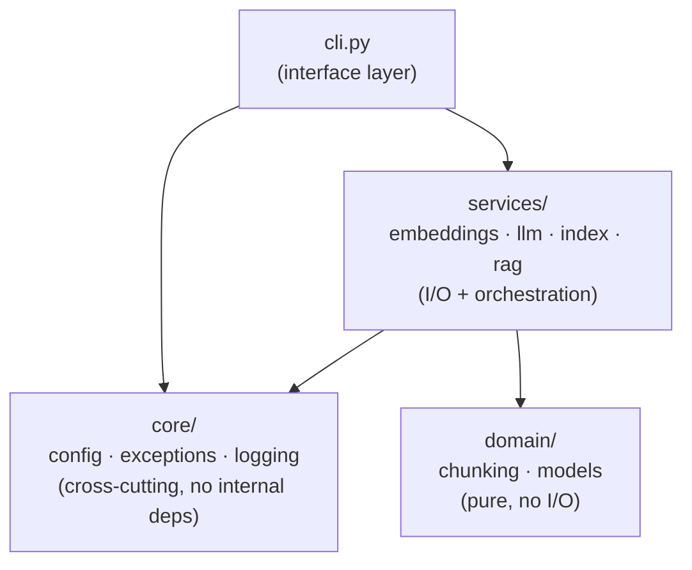

# plainrag: production-grade restructure

Status: approved, pending implementation plan
Date: 2026-09-13

## Context

`plainrag` (RAGLab project 01) is currently eight flat modules under
`src/plainrag/`: `chunking.py`, `embeddings.py`, `index.py`, `llm.py`,
`rag.py`, `logging_setup.py`, `cli.py`, `__init__.py`. It works and is
fully tested (38 tests, 100% coverage), but it has no config
abstraction (models/paths/limits are hardcoded defaults scattered
across `cli.py` and `rag.py`), no custom exception hierarchy (only a
bare `ValueError` in `chunking.py`), and no visible layering — everything
sits in one directory with no dependency direction enforced.

The goal is to harden this into something that reads as production-grade
Python: centralized settings, a real exception hierarchy with
CLI-level error handling instead of raw tracebacks, and a package
layout with an enforced, documented dependency direction — **without**
turning it into a framework or hiding the RAG mechanics the project
exists to demonstrate. The README's positioning ("nothing hidden
behind an abstraction") stays; only the engineering hygiene changes.

Two decisions were made up front (via AskUserQuestion):

1. **Scope**: layered, but still direct — settings + exceptions +
   clear layers, but services call `litellm` directly. No provider
   Protocol/DI, no plugin architecture.
2. **Positioning**: keep the teaching framing. The README explains the
   new structure but keeps "mechanics fully visible" as the headline.

A follow-up round shaped the concrete layout: cross-cutting concerns
(config, exceptions, logging) get their own package rather than
sitting loose next to `cli.py`, and `logging_setup.py` becomes
`logging.py`. A second follow-up asked for the logger itself to gain
separate console/file formatters and a startup banner — folded into
the `core/logging.py` section below.

## Package layout

```text
src/plainrag/
  __init__.py
  cli.py                  # entry point — the only loose module
  core/
    __init__.py
    config.py              # Settings (pydantic-settings) + get_settings()
    exceptions.py           # PlainRAGError hierarchy
    logging.py               # renamed from logging_setup.py
  domain/
    __init__.py
    models.py                # DocumentChunk, ScoredChunk, AnswerResult
    chunking.py                # chunk_text() — pure, unchanged logic
  services/
    __init__.py
    embeddings.py              # embed_texts()
    llm.py                      # prompt assembly + answer_question()
    index.py                     # CosineSimilarityIndex (search + persistence)
    rag.py                        # ingest_text(), ask() — orchestration
```



**Dependency rule**: arrows only point downward. `core/` depends on
nothing else in the package (it's the leaf). `domain/` depends on
nothing else either — pure functions and dataclasses. `services/` may
import from `domain/` and `core/`. `cli.py` may import from all three.
Nothing in `domain/` or `services/` imports from `cli.py`.

**Config stays at the edge.** Only `cli.py` calls `get_settings()`. It
resolves the CLI-flag > `.env`/env-var > code-default precedence once,
then passes plain values into `rag.ingest_text()` / `rag.ask()` as
explicit arguments — the same shape those functions already have
today. Nothing in `services/` or `domain/` reads global settings
itself, so they stay trivially testable with plain arguments, no
settings mocking required.

## `core/config.py`

```python
class Settings(BaseSettings):
    model_config = SettingsConfigDict(
        env_prefix="PLAINRAG_", env_file=".env", extra="ignore"
    )
    embedding_model: str = "text-embedding-3-small"
    chat_model: str = "gpt-4o-mini"
    chunk_size: int = 200
    chunk_overlap: int = 20
    retrieval_k: int = 4
    index_path: Path = Path(".plainrag_index.json")
    log_level: str = "INFO"
    log_file: Path | None = None

@lru_cache
def get_settings() -> Settings: ...
```

`log_file` defaults to `None` (console-only) — this stays a project
you can `uv run plainrag ...` without it quietly leaving files behind.
Setting `PLAINRAG_LOG_FILE=logs/plainrag.log` (or the `.env` equivalent)
turns file logging on.

No API-key field. `litellm` already reads `OPENAI_API_KEY` (or
whichever provider's key) directly from the environment and auto-loads
`.env` on import — duplicating it into `Settings` would just create a
second copy of a secret that risks appearing in a repr or log line.
`pydantic-settings` moves from a transitive dependency (already pulled
in by `litellm`) to an explicit one in `pyproject.toml`.

## `core/exceptions.py`

```python
class PlainRAGError(Exception): ...
class EmbeddingError(PlainRAGError): ...        # embedding call failed
class GenerationError(PlainRAGError): ...       # chat completion call failed
class IndexPersistenceError(PlainRAGError): ... # index file load/save failed
class EmptyIndexError(PlainRAGError): ...       # asked with nothing ingested
```

`chunking.chunk_text()`'s existing `ValueError` for bad `chunk_size`/
`overlap` **stays a `ValueError`** — that's argument validation on a
pure function, which is idiomatic Python, not a runtime/I/O failure.
The new hierarchy is specifically for things that can fail when
talking to the network or disk:

- `services/embeddings.py` catches `litellm` exceptions around
  `litellm.aembedding(...)` and re-raises `EmbeddingError(...) from e`.
- `services/llm.py` does the same around `litellm.acompletion(...)`,
  re-raising `GenerationError`.
- `services/index.py`'s `load()`/`save()` catch `OSError` /
  `json.JSONDecodeError` / `KeyError`(malformed records) and re-raise
  `IndexPersistenceError`.
- `services/rag.py`'s `ask()` raises `EmptyIndexError` when the index
  has nothing in it — this moves out of `cli.py`, where it currently
  lives as an ad-hoc `len(index) == 0` check, because "you can't
  answer from nothing" is a service-layer invariant, not a CLI
  concern.

## `core/logging.py`

Renamed from `logging_setup.py`. Two additions beyond the rename:
separate console/file formatters, and a one-time startup banner.

```python
_CONSOLE_FORMAT = "<green>{time:HH:mm:ss}</green> | <level>{level: <8}</level> | {message}"
_FILE_FORMAT = (
    "{time:YYYY-MM-DD HH:mm:ss} | {level: <8} | {name}:{function}:{line} | {message}"
)

def get_logger(*, level: str = "INFO", log_file: Path | None = None) -> Logger:
    """Configure (once) console + optional file sinks and return the logger."""
    ...
    _logger.add(sys.stderr, level=level, format=_CONSOLE_FORMAT)
    if log_file is not None:
        _logger.add(
            log_file, level=level, format=_FILE_FORMAT, rotation="10 MB", retention="7 days"
        )
    return _logger


def print_banner(version: str) -> None:
    """Print a one-time startup banner to the console (not logged)."""
    console = Console()
    console.print(
        Panel.fit(
            f"[bold cyan]plainrag[/] [dim]v{version}[/]\n"
            "[dim]RAG from scratch — no framework, no vector-DB service[/]",
            border_style="cyan",
        )
    )
```

The console sink stays terse and colored for interactive use; the file
sink (only added when `log_file` is set) is plain text with a
timestamp and `module:function:line`, meant for grepping later rather
than reading live. `rotation`/`retention` are loguru built-ins — no new
dependency for log management.

The banner uses `rich` (`Panel`, `Console`) — already an effective
dependency today via `typer`'s own use of it for help rendering, so
this makes an existing transitive dependency explicit in
`pyproject.toml` rather than adding a new one. `version` comes from
`importlib.metadata.version("plainrag")`, exposed as
`plainrag.__version__` in `src/plainrag/__init__.py`, so the version
string isn't duplicated between `pyproject.toml` and application code.

`cli.py` wires it up in an `@app.callback()`, which Typer runs once
before whichever subcommand was invoked — but not for `--help` (Click
resolves eager options like `--help` before the callback body runs),
so the banner shows on real usage, not on `plainrag --help`:

```python
_settings = get_settings()
log = get_logger(level=_settings.log_level, log_file=_settings.log_file)

@app.callback()
def main() -> None:
    """RAG from scratch: chunk, embed, retrieve, and answer — no framework."""
    print_banner(__version__)
```

## Error handling at the CLI boundary

Each Typer command wraps its body:

```python
try:
    ...
except PlainRAGError as e:
    log.error(str(e))
    raise typer.Exit(code=1) from e
```

This replaces raw tracebacks on provider failures, corrupt index
files, and the empty-index case with a single clean error line and
exit code 1 — the actual "production grade" tell for a CLI tool.

## Testing

Tests move to mirror the new layout:

```text
tests/
  test_cli.py
  test_config.py            # new
  core/
    __init__.py
    test_logging.py          # new: console/file sinks configured, banner prints once
  domain/
    __init__.py
    test_chunking.py
  services/
    __init__.py
    test_embeddings.py
    test_index.py
    test_llm.py
    test_rag.py
```

New coverage, not present today: embedding/chat call failure → correct
exception raised; corrupt/unreadable index file →
`IndexPersistenceError`; empty index → `EmptyIndexError`; each CLI
command's exit code and stderr message on each of those. Existing test
bodies are otherwise unchanged — just import-path updates and the new
failure-path cases layered on top.

## README

Add an "Architecture" section with the two Mermaid diagrams (layer
diagram above, plus a flow diagram for `ingest`/`ask` through the
modules), the dependency rule stated in prose, and an explicit "this
is still all visible, no framework" callout so the production-grade
structure doesn't read as a contradiction of the project's stated
purpose. Existing "What it does" section's file-path references
(`src/plainrag/chunking.py` etc.) get updated to the new paths.

## What does not change

The chunking algorithm, cosine-similarity math, prompt assembly, and
direct `litellm` calls are untouched — this is a reorganization and
hardening pass, not a rewrite. `Dockerfile`/`docker-compose.yml`/
`Makefile` need no changes (they already operate on `src/` and
`tests/` recursively). `pyproject.toml` needs two additions
(`pydantic-settings` and `rich` as direct dependencies — both already
installed transitively today) and no changes to
`[tool.hatch.build.targets.wheel]` (hatchling packages `src/plainrag`
recursively already).
